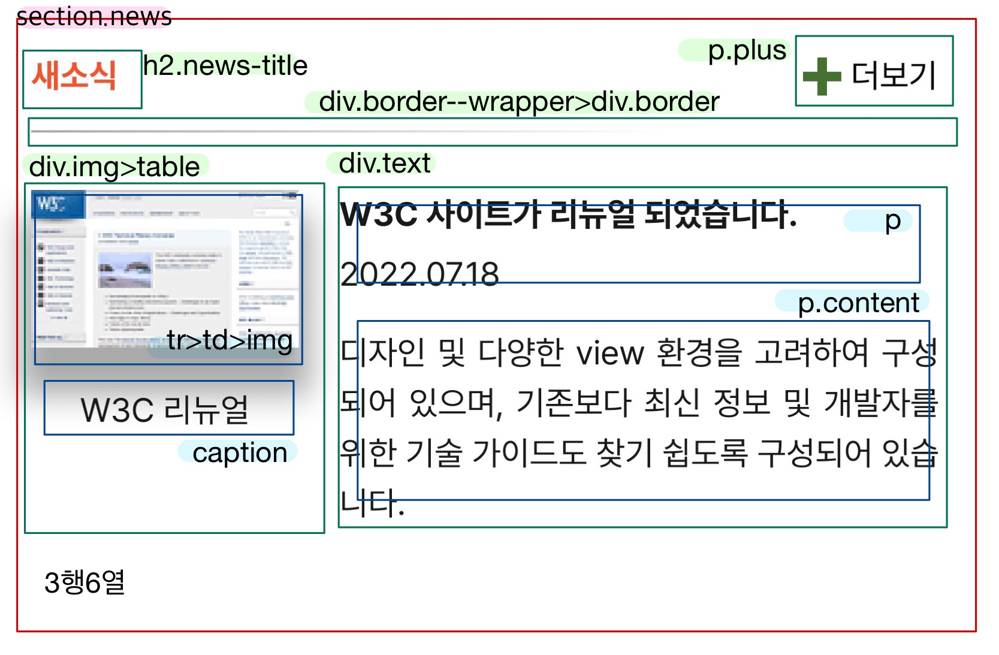
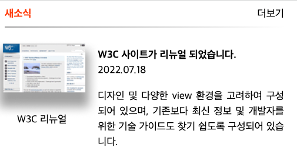

<h3>grid</h3> 

<h5>1. 마크업</h5>
 

<h5>2. CSS</h5>
section에 display: grid로 입력하고, 6행3열로 나눴다. 
"news-title . . . . plus" 
"border--wrapper border--wrapper border--wrapper border--wrapper border--wrapper border--wrapper" 
"img img text text text text"  

첫 행의 높이는 21px로 지정하고, '더보기'는 text-align으로 오른쪽 정렬을 했다. 
두 번째 행의 높이는 12px로 하고, 그 안에 높이 1px 배경을 align-self:center를 이용해 가운데 정렬 시켰다. 
마지막 행에서 table을 감싼 div에 position: relative를 주고, 테이블 안에 속한 caption에 position: absolute를 줘서 아래로 이동시켰다. 그리고 이미지를 왼쪽에 밀착시키기 위해 margin: -20px을 주었다. 
3행의 오른쪽 아래 문단은 양쪽 정렬을 위해 text-align: justify를 사용했다.  

<h5>3. 결과</h5>

