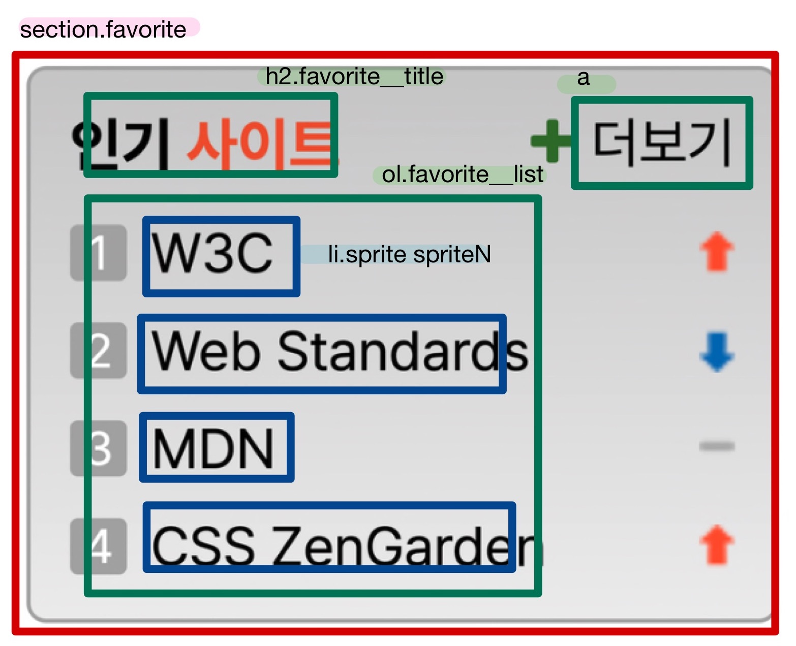
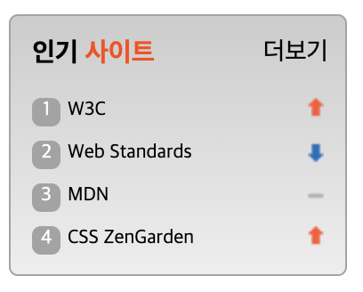

<h3>mission-05 (sprite)</h3>

<h5>1. 마크업</h5>

<h5>2. CSS</h5>
ul 태그에 display:grid;를 설정하고 4행 1열로 나눠 각 행에 순위별로 위치를 지정했다. 
왼쪽의 숫자는 가상 요소로 꾸며줬다. 
오른쪽의 화살표는 스트라이트를 사용했다. 
더보기는 translate로 위치를 옮겼다. 

<h5>3. 결과</h5>

